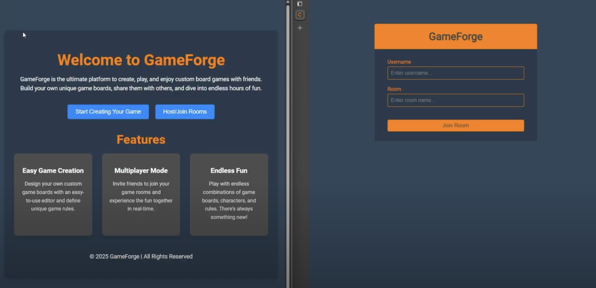

# My-Portfolio

Welcome to my GitHub Portfolio! Below you'll find information about my Capstone project. More projects will be added later in the term.

---

## 🎲 Capstone Project: Create and Play Board Games

**Team Members**: Hriday Ampavatina, Alexander Maxwell, Blayton Vidrine, Mikaella Brewer 
**Course**: CS 463 – Spring 2025, Oregon State University

### Project Overview
Create and Play Board Games is a **multiplayer web-based application** that allows users to **design**, **customize**, and **play digital board games** online with others. The project emphasizes core game design flexibility, smooth online gameplay, and real-time synchronization between players.

**Goal**: Deliver a fully functional and stable online board game platform with customizable gameplay experiences.

### Key Features
- A main menu with access to **Settings**, **Board Editor**, and **Hosting/Joining Game Rooms**
- A **Board Editor** to create and download custom game boards
- **Multiplayer gameplay** with support for real-time board syncing
- **Turn-based mechanics** and **game state persistence** (save/load sessions)
- Player **token customization**
- Improved **UI/UX** for a clean and intuitive user experience
- **User documentation** and tutorials for new players

---

### 📷 Images & Media

*Example of the custom board editor interface.*

---

Stay tuned as I add more of my class and personal projects to this portfolio!
